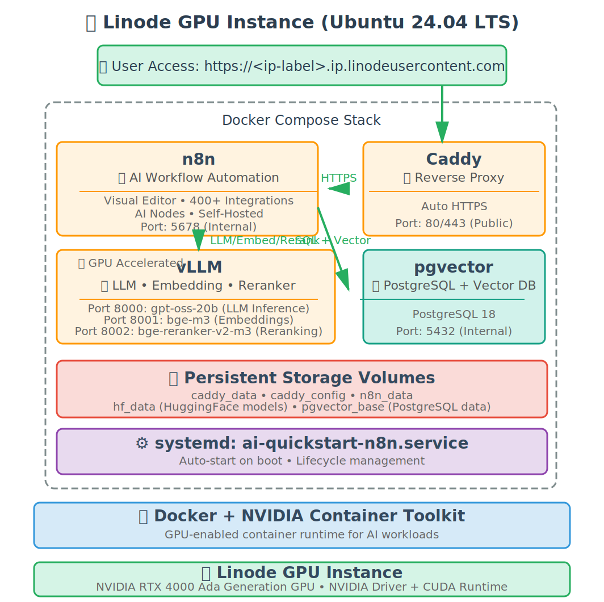

# Akamai Cloud - AI Quickstart : n8n AI Workflow Automation

Automated deployment script to run your private, self-hosted AI workflow automation platform on Akamai Cloud GPU instances. This stack combines vLLM for high-performance LLM inference with n8n - a powerful workflow automation tool that lets you build AI-powered automations with a visual editor.

-----------------------------------------
## 🚀 Quick Start

Just run this single command:

```bash
curl -fsSL https://raw.githubusercontent.com/linode/ai-quickstart-n8n/main/deploy.sh | bash
```

That's it! The script will download required files and guide you through the interactive deployment process.

## ✨ Features
- **Fully Automated Deployment**: Handles instance creation with real-time progress tracking
- **Ready to use AI Stack**: vLLM for GPU-accelerated inference + n8n for AI workflow automation
- **Visual Workflow Builder**: Create complex AI workflows with n8n's drag-and-drop interface
- **OpenAI-Compatible API**: Use vLLM as a drop-in replacement for OpenAI in your workflows
- **Cross-Platform Support**: Works on macOS, Linux, and Windows (Git Bash/WSL)

-----------------------------------------

## 🏗️ What Gets Deployed



<br clear="left"/>

### Linode GPU Instance with
- Ubuntu 24.04 LTS with NVIDIA drivers
- Docker & NVIDIA Container Toolkit
- Systemd service for automatic startup on reboot

### Docker Containers
| | Service | Description |
|:--:|:--|:--|
|  | **Caddy** | Reverse proxy with automatic HTTPS (port 80/443) |
|  | **n8n** | AI workflow automation platform with visual editor (port 5678, internal) |
|  | **vLLM** | High-throughput LLM inference engine with OpenAI-compatible API (port 8000, internal) |
|  | **Embedding** | Text embedding model for vector search (BAAI/bge-m3, port 8001, internal) |
|  | **Reranker** | Semantic reranking model (BAAI/bge-reranker-v2-m3, port 8002, internal) |
|  | **pgvector** | PostgreSQL database with vector extension for n8n (port 5432, internal) |

### Models

#### LLM: openai/gpt-oss-20b
[gpt-oss-20b](https://huggingface.co/openai/gpt-oss-20b) is OpenAI's first fully open-source LLM, released under Apache 2.0 license. Key characteristics:
- **20B parameters**: Fits on a single RTX 4000 Ada GPU (20GB VRAM)
- **High benchmark scores**: Competitive with larger models on reasoning and instruction-following tasks
- **High throughput**: Optimized for fast token generation with vLLM inference engine

#### Embedding: BAAI/bge-m3
[BGE-M3](https://huggingface.co/BAAI/bge-m3) is a multilingual embedding model for semantic search and RAG applications:
- **Multilingual support**: 100+ languages
- **Multi-functionality**: Dense retrieval, sparse retrieval, and multi-vector retrieval
- **Optimized for RAG**: Perfect for n8n AI workflows requiring vector search

#### Reranker: BAAI/bge-reranker-v2-m3
[BGE Reranker V2](https://huggingface.co/BAAI/bge-reranker-v2-m3) improves search result relevance:
- **Semantic reranking**: Reorders search results by semantic similarity
- **Lightweight**: Efficient model for real-time reranking
- **Multilingual**: Supports cross-lingual reranking tasks

### What is n8n?
[n8n](https://n8n.io/) is a powerful workflow automation tool that lets you connect anything to everything. Key features include:
- **Visual Workflow Builder**: Create complex automations with a drag-and-drop interface
- **400+ Integrations**: Connect to databases, APIs, SaaS tools, and more
- **AI Capabilities**: Built-in AI nodes for LLM integration, embeddings, and vector stores
- **Self-Hosted**: Full control over your data and workflows - nothing leaves your server
- **PostgreSQL Backend**: Production-ready database with pgvector extension for AI workflows

-----------------------------------------

## 📋 Requirements

### Akamai Cloud Account
- Active Linode account with GPU access enabled

### Local System Requirements
- **Required**: bash, curl, ssh, jq
- **Note**: jq will be auto-installed if missing

-----------------------------------------
## 🚦 Getting Started

### 1. Option A: Single Command Execution

No installation required - just run:

```bash
curl -fsSL https://raw.githubusercontent.com/linode/ai-quickstart-n8n/main/deploy.sh | bash
```

### 1. Option B: Download and Run

Download the script and run locally:

```bash
curl -fsSLO https://raw.githubusercontent.com/linode/ai-quickstart-n8n/main/deploy.sh
bash deploy.sh
```

### 1. Option C: Clone Repository

If you prefer to inspect or customize the scripts:

```bash
git clone https://github.com/linode/ai-quickstart-n8n
cd ai-quickstart-n8n
./deploy.sh
```

> [!NOTE]
> if you like to add more services check out docker compose template file
> ```
> vi /template/docker-compose.yml
> ```
>

### 2. Follow Interactive Prompts
The script will ask you to:
- Choose a region (e.g., us-east, eu-west)
- Select GPU instance type
- Provide instance label
- Select or generate SSH keys
- Confirm deployment

### 3. Wait for Deployment
The script automatically:
- Creates GPU instance in your Linode account
- Monitors cloud-init installation progress
- Waits for n8n health check
- Waits for vLLM model loading

### 4. Access Your Services
Once complete, you'll see:
```
🎉 Setup Complete!

✅ Your AI LLM instance is now running!

🌐 Access URLs:
   n8n:  https://<ip-label>.ip.linodeusercontent.com

🔐 Access Credentials:
   SSH:   ssh -i /path/to/your/key root@<instance-ip>
```

### Configuration files in GPU Instance
```
   # Bootstrap script called by cloud-init service
   /opt/ai-quickstart-n8n/bootstrap.sh

   # docker compose file called by systemctl at startup
   /opt/ai-quickstart-n8n/docker-compose.yml

   # Caddy reverse proxy configuration
   /opt/ai-quickstart-n8n/Caddyfile

   # service definition
   /etc/systemd/system/ai-quickstart-n8n.service
```

-----------------------------------------

## 🗑️ Delete Instance

To delete a deployed instance:

```bash
# Remote execution
curl -fsSL https://raw.githubusercontent.com/linode/ai-quickstart-n8n/main/delete.sh | bash -s -- <instance_id>

# Or download script and run
curl -fsSLO https://raw.githubusercontent.com/linode/ai-quickstart-n8n/main/delete.sh
bash delete.sh <instance_id>
```

The script will show instance details and ask for confirmation before deletion.

-----------------------------------------

## 📁 Project Structure

```
ai-quickstart-n8n/
├── deploy.sh                    # Main deployment script
├── delete.sh                    # Instance deletion script
├── template/
│   ├── cloud-init.yaml          # Cloud-init configuration
│   └── bootstrap.sh             # Post-boot installation script
└── setup/
    ├── docker-compose.yml       # Docker Compose configuration
    ├── Caddyfile                # Caddy reverse proxy configuration
    ├── setup.sh                 # Setup script run by systemd
    ├── n8n_credentials.json     # n8n credentials template
    └── n8n_workflow.json        # n8n workflow template
```

-----------------------------------------
## 🔒 Security

**⚠️ IMPORTANT**: By default, ports 80 and 443 are exposed to the internet

### Immediate Security Steps

1. **Configure Cloud Firewall** (Recommended)
   - Create Linode Cloud Firewall
   - Restrict access to ports 80/443 by source IP
   - Allow SSH (port 22) from trusted IPs only

2. **SSH Security**
   - SSH key authentication required
   - Root password provided for emergency console access only

-----------------------------------------
## 🛠️ Useful Commands

```bash
# SSH into your instance
ssh -i /path/to/your/key root@<instance-ip>

# Check container status
docker ps -a

# Check Docker containers log
cd /opt/ai-quickstart-n8n && docker compose logs -f

# Check systemd service status
systemctl status ai-quickstart-n8n.service

# View systemd service logs
journalctl -u ai-quickstart-n8n.service -n 100

# Check cloud-init logs
tail -f /var/log/cloud-init-output.log -n 100

# Restart all services
systemctl restart ai-quickstart-n8n.service

# Check NVIDIA GPU status
nvidia-smi

# Check vLLM loaded models
curl http://localhost:8000/v1/models

# Check embedding model
curl http://localhost:8001/v1/models

# Check reranker model
curl http://localhost:8002/v1/models

# Check n8n health
curl http://localhost:5678/healthz

# Check PostgreSQL database
docker exec -it pgvector psql -U n8n -d n8n -c "SELECT version();"

# Check container logs
docker logs vllm
docker logs embedding
docker logs reranker
docker logs n8n
docker logs pgvector
```

## 🤝 Contributing

Issues and pull requests are welcome! For major changes, please open an issue first to discuss what you would like to change.

## 📄 License

This project is licensed under the Apache License 2.0.

